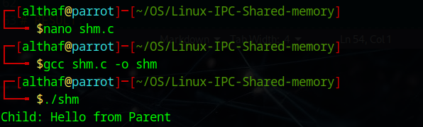

# Linux-IPC-Shared-memory
Ex06-Linux IPC-Shared-memory

# AIM:
To Write a C program that illustrates two processes communicating using shared memory.

# DESIGN STEPS:

### Step 1:

Navigate to any Linux environment installed on the system or installed inside a virtual environment like virtual box/vmware or online linux JSLinux (https://bellard.org/jslinux/vm.html?url=alpine-x86.cfg&mem=192) or docker.

### Step 2:

Write the C Program using Linux Process API - Shared Memory

### Step 3:

Execute the C Program for the desired output. 

# PROGRAM:

## Write a C program that illustrates two processes communicating using shared memory.


```
#include <stdio.h>
#include <sys/shm.h>
#include <sys/wait.h>
#include <unistd.h>
int main() {
    int id = shmget(1234, 100, 0666 | IPC_CREAT);
    char *p = shmat(id, NULL, 0);

    if (fork() == 0) {
        printf("Child: %s\n", p);
    } else {
        sprintf(p, "Hello from Parent");
        wait(NULL);
    }

    shmdt(p);
    shmctl(id, IPC_RMID, NULL);

    return 0;
}

```


## OUTPUT



# RESULT:
The program is executed successfully.
